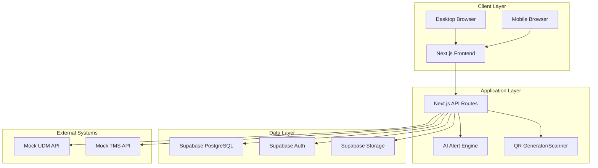
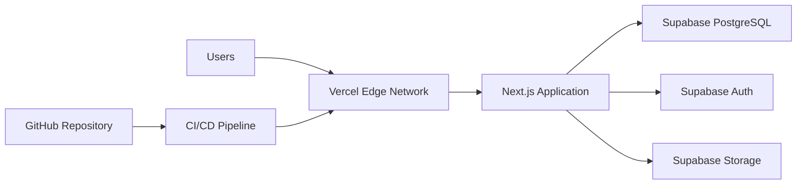

# Design Document

## Overview

RailTrack QR is a full-stack web application built with Next.js 14 (App Router) and TypeScript, leveraging Supabase for backend services. The system follows a mobile-first design approach with progressive web app capabilities, enabling field inspectors to scan QR codes and log inspections using their mobile devices. The architecture emphasizes real-time data synchronization, role-based access control, and AI-driven analytics for predictive maintenance.

### Key Design Principles

1. **Mobile-First:** Optimized for field use with responsive design and offline capabilities
2. **Scalability:** Designed to handle 23.5 crore (235 million) fittings with efficient database indexing
3. **Security:** Role-based access control with Supabase Auth and Row Level Security (RLS)
4. **Real-Time:** Live updates for inspections, alerts, and dashboard metrics
5. **Modularity:** Component-based architecture for maintainability and reusability

## Architecture

### High-Level Architecture



### Technology Stack Rationale


- **Next.js 14:** Server-side rendering, API routes, and App Router for optimal performance
- **TypeScript:** Type safety and better developer experience
- **Supabase:** Managed PostgreSQL with built-in auth, real-time subscriptions, and storage
- **Tailwind CSS + shadcn/ui:** Rapid UI development with accessible components
- **html5-qrcode:** Cross-browser QR scanning with mobile camera support
- **Recharts:** Declarative charts for analytics dashboard

## Components and Interfaces

### Frontend Components

#### 1. Authentication Components

**LoginForm Component**
- Email/password input fields with validation
- Role-based redirect after successful authentication
- Error handling for invalid credentials
- Integration with Supabase Auth

**SignupForm Component**
- User registration with role selection
- Email verification flow
- Form validation using react-hook-form and zod

#### 2. Dashboard Components

**DashboardLayout Component**
- Responsive sidebar navigation
- Header with user profile and logout
- Role-based menu items
- Mobile hamburger menu

**StatsCard Component**
- Displays key metrics (total fittings, inspections, alerts)
- Click-through navigation to detailed views
- Real-time updates via Supabase subscriptions

**AlertsWidget Component**
- Displays unresolved alerts with severity badges
- Grouped by severity (critical, high, medium, low)
- Quick actions to resolve or view details

#### 3. Fitting Management Components

**FittingForm Component**
- Multi-step form for creating fittings
- Part type selection with visual icons
- Date picker for supply date
- Warranty calculation preview
- QR code generation on submit

**FittingCard Component**
- Displays fitting summary with QR code thumbnail
- Status indicator (active, under_inspection, failed, replaced)
- Warranty expiry countdown
- Quick actions (view details, add inspection)

**QRCodeDisplay Component**
- Large QR code visualization
- Download as PNG button
- Print functionality
- Copy QR code text

**FittingsTable Component**
- Sortable columns (QR code, part type, manufacturer, warranty status)
- Multi-filter support (part type, manufacturer, status, warranty)
- Search functionality
- Pagination (50 items per page)
- Export to CSV


#### 4. Inspection Components

**QRScanner Component**
- Camera feed with scanning overlay
- Auto-detection and validation
- Manual entry fallback
- Error handling for invalid QR codes
- Success feedback with haptic/audio cues

**InspectionForm Component**
- Inspection type dropdown (manufacturing, supply, in_service, maintenance)
- Status selection (pass, fail, needs_attention)
- Notes textarea with character counter
- GPS auto-capture with manual override
- Image upload (max 5 images, 5MB each)
- Preview uploaded images before submit

**InspectionHistory Component**
- Timeline view of inspections
- Expandable inspection cards
- Image gallery with lightbox
- GPS location map integration
- Filter by status, date range, inspector

#### 5. Analytics Components

**InspectionTrendsChart Component**
- Line chart showing inspections over time
- Grouped by inspection status
- Date range selector (7 days, 30 days, 90 days, custom)
- Recharts implementation

**FailureRateChart Component**
- Bar chart showing failure rates by part type
- Comparison with industry benchmarks
- Drill-down to specific manufacturers

**VendorComparisonChart Component**
- Radar chart comparing vendor metrics
- Quality score, failure rate, delivery performance
- Interactive legend for vendor selection

**WarrantyTimelineChart Component**
- Gantt-style timeline showing warranty expiry
- Color-coded by urgency (critical, high, medium)
- Filterable by part type and location

#### 6. Vendor Management Components

**VendorTable Component**
- Displays vendor code, name, quality score, failure rate
- Color-coded quality indicators
- Sortable columns
- Click-through to vendor details

**VendorDetailCard Component**
- Comprehensive vendor metrics
- Inspection history for vendor's fittings
- Failure trend chart
- Contact information and notes


### Backend API Routes

#### Authentication APIs

**POST /api/auth/login**
- Request: `{ email: string, password: string }`
- Response: `{ user: User, session: Session }`
- Validates credentials via Supabase Auth
- Returns user role for client-side routing

**POST /api/auth/signup**
- Request: `{ email: string, password: string, name: string, role: string, depot_location?: string }`
- Response: `{ user: User, session: Session }`
- Creates user in Supabase Auth
- Inserts user record in users table

**POST /api/auth/logout**
- Clears session and redirects to login

#### Fitting APIs

**GET /api/fittings**
- Query params: `page`, `limit`, `part_type`, `manufacturer`, `status`, `search`
- Response: `{ fittings: Fitting[], total: number, page: number }`
- Implements pagination and filtering
- Includes warranty status calculation

**POST /api/fittings**
- Request: `{ part_type, manufacturer, lot_number, supply_date, warranty_months, quantity, current_location }`
- Response: `{ fitting: Fitting, qr_code: string }`
- Generates unique QR code
- Calculates warranty expiry
- Triggers mock UDM sync
- Checks for duplicate QR codes

**GET /api/fittings/[id]**
- Response: `{ fitting: Fitting, inspections: Inspection[], alerts: Alert[] }`
- Returns fitting details with related data

**PATCH /api/fittings/[id]**
- Request: `{ status?, current_location?, metadata? }`
- Response: `{ fitting: Fitting }`
- Updates fitting fields

#### Inspection APIs

**GET /api/inspections**
- Query params: `fitting_id`, `inspector_id`, `status`, `start_date`, `end_date`
- Response: `{ inspections: Inspection[] }`
- Filters inspections by parameters

**POST /api/inspections**
- Request: `{ fitting_id, inspection_type, status, notes, gps_latitude, gps_longitude, images }`
- Response: `{ inspection: Inspection, alerts: Alert[] }`
- Saves inspection record
- Uploads images to Supabase Storage
- Updates fitting status based on inspection result
- Triggers AI alert analysis
- Triggers mock TMS sync


#### Alert APIs

**GET /api/alerts**
- Query params: `resolved`, `severity`, `alert_type`
- Response: `{ alerts: Alert[] }`
- Returns alerts with filtering

**PATCH /api/alerts/[id]**
- Request: `{ resolved: boolean }`
- Response: `{ alert: Alert }`
- Marks alert as resolved

#### AI Analysis APIs

**POST /api/ai/analyze**
- Request: `{ fitting_id, inspection_id }`
- Response: `{ alerts: Alert[], predictions: Prediction[] }`
- Runs AI alert rules
- Generates warranty expiry alerts
- Checks vendor quality thresholds
- Predicts failure risk
- Detects duplicate inspections

**GET /api/ai/predict**
- Query params: `fitting_id`
- Response: `{ failure_probability: number, risk_level: string, factors: string[] }`
- Calculates failure prediction using regression model
- Returns risk factors and recommendations

#### Vendor APIs

**GET /api/vendors**
- Response: `{ vendors: Vendor[] }`
- Returns all vendors with calculated quality scores

**GET /api/vendors/[id]**
- Response: `{ vendor: Vendor, fittings: Fitting[], inspections: Inspection[] }`
- Returns vendor details with related data

**PATCH /api/vendors/[id]**
- Request: `{ quality_score, failure_rate, total_supplies, total_inspections, failed_inspections }`
- Response: `{ vendor: Vendor }`
- Updates vendor metrics

#### Sync APIs

**POST /api/sync/udm**
- Request: `{ vendor_code }`
- Response: `{ success: boolean, data: UDMData, sync_log: SyncLog }`
- Simulates UDM API call to www.ireps.gov.in
- Returns mock vendor data
- Logs sync operation

**POST /api/sync/tms**
- Request: `{ track_section }`
- Response: `{ success: boolean, data: TMSData, sync_log: SyncLog }`
- Simulates TMS API call to www.irecept.gov.in
- Returns mock track section data
- Logs sync operation

**GET /api/sync/logs**
- Query params: `sync_type`, `status`, `start_date`, `end_date`
- Response: `{ logs: SyncLog[] }`
- Returns sync history


## Data Models

### Database Schema

#### Users Table
```typescript
interface User {
  id: string;                    // UUID primary key
  email: string;                 // Unique, not null
  name: string;                  // Not null
  role: 'depot_manager' | 'inspector' | 'admin';
  depot_location?: string;
  phone?: string;
  created_at: Date;
}
```

#### Fittings Table
```typescript
interface Fitting {
  id: string;                    // UUID primary key
  qr_code: string;               // Unique, format: IR-[TYPE]-[MANUFACTURER]-[LOT]-[TIMESTAMP]
  part_type: 'elastic_rail_clip' | 'rail_pad' | 'liner' | 'sleeper';
  manufacturer: string;
  lot_number: string;
  supply_date: Date;
  warranty_months: number;
  warranty_expiry: Date;         // Calculated: supply_date + warranty_months
  quantity: number;              // Default: 1
  current_location: string;
  status: 'active' | 'under_inspection' | 'failed' | 'replaced';
  created_by: string;            // Foreign key to users.id
  created_at: Date;
  metadata?: Record<string, any>; // JSONB for extensibility
}
```

#### Inspections Table
```typescript
interface Inspection {
  id: string;                    // UUID primary key
  fitting_id: string;            // Foreign key to fittings.id
  inspector_id: string;          // Foreign key to users.id
  inspection_type: 'manufacturing' | 'supply' | 'in_service' | 'maintenance';
  status: 'pass' | 'fail' | 'needs_attention';
  notes?: string;
  gps_latitude?: number;         // Decimal(10, 8)
  gps_longitude?: number;        // Decimal(11, 8)
  images?: string[];             // Array of Supabase Storage URLs
  timestamp: Date;
}
```

#### Vendors Table
```typescript
interface Vendor {
  id: string;                    // UUID primary key
  vendor_code: string;           // Unique, not null
  vendor_name: string;
  total_supplies: number;        // Default: 0
  total_inspections: number;     // Default: 0
  failed_inspections: number;    // Default: 0
  failure_rate: number;          // Decimal(5, 2), calculated
  quality_score: number;         // Decimal(5, 2), formula: 100 - (failure_rate × 2)
  last_sync: Date;
}
```


#### Alerts Table
```typescript
interface Alert {
  id: string;                    // UUID primary key
  fitting_id: string;            // Foreign key to fittings.id
  alert_type: 'warranty_expiry' | 'vendor_quality' | 'failure_prediction' | 'duplicate_inspection';
  severity: 'low' | 'medium' | 'high' | 'critical';
  message: string;
  resolved: boolean;             // Default: false
  created_at: Date;
}
```

#### Sync Logs Table
```typescript
interface SyncLog {
  id: string;                    // UUID primary key
  sync_type: 'udm' | 'tms';
  status: 'success' | 'failed';
  records_synced: number;        // Default: 0
  error_message?: string;
  timestamp: Date;
}
```

### Database Indexes

For optimal query performance with 235 million fittings:

```sql
-- Fittings indexes
CREATE INDEX idx_fittings_qr ON fittings(qr_code);
CREATE INDEX idx_fittings_status ON fittings(status);
CREATE INDEX idx_fittings_part_type ON fittings(part_type);
CREATE INDEX idx_fittings_manufacturer ON fittings(manufacturer);
CREATE INDEX idx_fittings_warranty_expiry ON fittings(warranty_expiry);

-- Inspections indexes
CREATE INDEX idx_inspections_fitting ON inspections(fitting_id);
CREATE INDEX idx_inspections_inspector ON inspections(inspector_id);
CREATE INDEX idx_inspections_timestamp ON inspections(timestamp);
CREATE INDEX idx_inspections_status ON inspections(status);

-- Alerts indexes
CREATE INDEX idx_alerts_fitting ON alerts(fitting_id);
CREATE INDEX idx_alerts_resolved ON alerts(resolved);
CREATE INDEX idx_alerts_severity ON alerts(severity);
CREATE INDEX idx_alerts_created_at ON alerts(created_at);

-- Vendors indexes
CREATE INDEX idx_vendors_code ON vendors(vendor_code);
CREATE INDEX idx_vendors_quality_score ON vendors(quality_score);
```

### Row Level Security (RLS) Policies

```sql
-- Users can only read their own profile
CREATE POLICY "Users can view own profile" ON users
  FOR SELECT USING (auth.uid() = id);

-- Depot managers can create fittings
CREATE POLICY "Depot managers can create fittings" ON fittings
  FOR INSERT WITH CHECK (
    EXISTS (SELECT 1 FROM users WHERE id = auth.uid() AND role = 'depot_manager')
  );

-- All authenticated users can read fittings
CREATE POLICY "Authenticated users can view fittings" ON fittings
  FOR SELECT USING (auth.role() = 'authenticated');

-- Inspectors can create inspections
CREATE POLICY "Inspectors can create inspections" ON inspections
  FOR INSERT WITH CHECK (
    EXISTS (SELECT 1 FROM users WHERE id = auth.uid() AND role IN ('inspector', 'depot_manager', 'admin'))
  );

-- Users can view inspections for fittings they have access to
CREATE POLICY "Users can view inspections" ON inspections
  FOR SELECT USING (auth.role() = 'authenticated');

-- Admins can view all vendor data
CREATE POLICY "Admins can view vendors" ON vendors
  FOR SELECT USING (
    EXISTS (SELECT 1 FROM users WHERE id = auth.uid() AND role = 'admin')
  );
```


## AI Alert Engine Design

### Alert Rule Engine Architecture

```typescript
// lib/ai/alertEngine.ts
interface AlertRule {
  type: AlertType;
  condition: (context: AlertContext) => boolean;
  severity: (context: AlertContext) => Severity;
  message: (context: AlertContext) => string;
}

interface AlertContext {
  fitting: Fitting;
  inspection?: Inspection;
  vendor?: Vendor;
  recentInspections?: Inspection[];
  lotInspections?: Inspection[];
}
```

### Alert Rules Implementation

#### 1. Warranty Expiry Alerts

```typescript
const warrantyExpiryRule: AlertRule = {
  type: 'warranty_expiry',
  condition: (ctx) => {
    const daysUntilExpiry = differenceInDays(ctx.fitting.warranty_expiry, new Date());
    return daysUntilExpiry <= 180;
  },
  severity: (ctx) => {
    const daysUntilExpiry = differenceInDays(ctx.fitting.warranty_expiry, new Date());
    if (daysUntilExpiry < 30) return 'critical';
    if (daysUntilExpiry < 90) return 'high';
    return 'medium';
  },
  message: (ctx) => {
    const daysUntilExpiry = differenceInDays(ctx.fitting.warranty_expiry, new Date());
    if (daysUntilExpiry < 0) return 'Warranty EXPIRED - Replace immediately';
    return `Warranty expires in ${daysUntilExpiry} days - Plan replacement`;
  }
};
```

#### 2. Vendor Quality Alerts

```typescript
const vendorQualityRule: AlertRule = {
  type: 'vendor_quality',
  condition: (ctx) => {
    return ctx.vendor && ctx.vendor.failure_rate >= 10;
  },
  severity: (ctx) => {
    const rate = ctx.vendor!.failure_rate;
    if (rate >= 20) return 'critical';
    if (rate >= 15) return 'high';
    return 'medium';
  },
  message: (ctx) => {
    const rate = ctx.vendor!.failure_rate;
    return `Vendor ${ctx.vendor!.vendor_name} has ${rate}% failure rate - Review quality`;
  }
};
```

#### 3. Failure Prediction Alerts

```typescript
const failurePredictionRule: AlertRule = {
  type: 'failure_prediction',
  condition: (ctx) => {
    const needsAttentionCount = ctx.recentInspections?.filter(
      i => i.status === 'needs_attention' && 
      differenceInMonths(new Date(), i.timestamp) <= 6
    ).length || 0;
    
    const lotFailureCount = ctx.lotInspections?.filter(
      i => i.status === 'fail'
    ).length || 0;
    
    return needsAttentionCount >= 2 || lotFailureCount >= 3;
  },
  severity: (ctx) => {
    const lotFailureCount = ctx.lotInspections?.filter(i => i.status === 'fail').length || 0;
    return lotFailureCount >= 3 ? 'critical' : 'high';
  },
  message: (ctx) => {
    const needsAttentionCount = ctx.recentInspections?.filter(
      i => i.status === 'needs_attention'
    ).length || 0;
    
    if (needsAttentionCount >= 2) {
      return `High failure risk - ${needsAttentionCount} attention flags in 6 months`;
    }
    return `Critical lot issue - Multiple failures detected in lot ${ctx.fitting.lot_number}`;
  }
};
```


#### 4. Duplicate Inspection Detection

```typescript
const duplicateInspectionRule: AlertRule = {
  type: 'duplicate_inspection',
  condition: (ctx) => {
    if (!ctx.inspection) return false;
    
    const recentInspection = ctx.recentInspections?.find(
      i => i.id !== ctx.inspection!.id && 
      differenceInHours(ctx.inspection!.timestamp, i.timestamp) <= 24
    );
    
    return !!recentInspection;
  },
  severity: () => 'low',
  message: (ctx) => {
    return `Duplicate inspection detected - Fitting inspected twice within 24 hours`;
  }
};
```

### Vendor Quality Scoring Algorithm

```typescript
// lib/ai/vendorScoring.ts
interface VendorMetrics {
  total_supplies: number;
  total_inspections: number;
  failed_inspections: number;
  late_deliveries: number;
}

function calculateVendorQualityScore(metrics: VendorMetrics): number {
  const failure_rate = metrics.total_inspections > 0 
    ? (metrics.failed_inspections / metrics.total_inspections) * 100 
    : 0;
  
  const quality_score = 100 - (failure_rate * 2) - (metrics.late_deliveries * 0.5);
  
  return Math.max(0, Math.min(100, quality_score)); // Clamp between 0-100
}

function getQualityStatus(score: number): string {
  if (score > 90) return 'Excellent';
  if (score >= 75) return 'Good';
  if (score >= 60) return 'Average';
  return 'Poor';
}
```

### Failure Prediction Model

```typescript
// lib/ai/failurePrediction.ts
interface PredictionFactors {
  age_months: number;
  inspection_count: number;
  needs_attention_count: number;
  vendor_failure_rate: number;
  lot_failure_count: number;
}

function predictFailureProbability(factors: PredictionFactors): number {
  // Simple linear regression model
  const weights = {
    age: 0.02,              // 2% per month
    inspections: 0.05,      // 5% per inspection
    attention: 0.15,        // 15% per attention flag
    vendor_rate: 0.5,       // 50% of vendor failure rate
    lot_failures: 0.1       // 10% per lot failure
  };
  
  const probability = 
    (factors.age_months * weights.age) +
    (factors.inspection_count * weights.inspections) +
    (factors.needs_attention_count * weights.attention) +
    (factors.vendor_failure_rate * weights.vendor_rate) +
    (factors.lot_failure_count * weights.lot_failures);
  
  return Math.min(100, probability); // Cap at 100%
}

function getRiskLevel(probability: number): string {
  if (probability >= 70) return 'critical';
  if (probability >= 50) return 'high';
  if (probability >= 30) return 'medium';
  return 'low';
}
```


## QR Code System Design

### QR Code Generation

```typescript
// lib/utils/qrGenerator.ts
import QRCode from 'qrcode';

interface QRCodeData {
  part_type: string;
  manufacturer: string;
  lot_number: string;
  timestamp: number;
}

function generateQRCode(data: QRCodeData): string {
  const { part_type, manufacturer, lot_number, timestamp } = data;
  
  // Format: IR-[TYPE]-[MANUFACTURER]-[LOT]-[TIMESTAMP]
  const typeCode = part_type.toUpperCase().replace('_', '');
  const mfgCode = manufacturer.toUpperCase().replace(/[^A-Z0-9]/g, '').substring(0, 10);
  const lotCode = lot_number.toUpperCase().replace(/[^A-Z0-9]/g, '');
  
  return `IR-${typeCode}-${mfgCode}-${lotCode}-${timestamp}`;
}

async function generateQRCodeImage(qrText: string): Promise<string> {
  // Generate QR code as data URL
  const qrDataUrl = await QRCode.toDataURL(qrText, {
    errorCorrectionLevel: 'H',  // High error correction for durability
    width: 512,                  // High resolution for printing
    margin: 2,
    color: {
      dark: '#000000',
      light: '#FFFFFF'
    }
  });
  
  return qrDataUrl;
}
```

### QR Code Scanning

```typescript
// components/scanner/QRScanner.tsx
import { Html5Qrcode } from 'html5-qrcode';

interface ScannerConfig {
  fps: number;              // Frames per second
  qrbox: { width: number; height: number };
  aspectRatio: number;
}

const scannerConfig: ScannerConfig = {
  fps: 10,
  qrbox: { width: 250, height: 250 },
  aspectRatio: 1.0
};

function validateQRFormat(qrText: string): boolean {
  // Validate format: IR-[TYPE]-[MANUFACTURER]-[LOT]-[TIMESTAMP]
  const pattern = /^IR-[A-Z]+-[A-Z0-9]+-[A-Z0-9]+-\d+$/;
  return pattern.test(qrText);
}
```


## Mock UDM/TMS Integration Design

### Mock UDM Integration (www.ireps.gov.in)

```typescript
// lib/integrations/mockUDM.ts
interface UDMVendorData {
  vendor_code: string;
  vendor_name: string;
  total_orders: number;
  pending_deliveries: number;
  quality_rating: number;
  last_delivery_date: string;
}

async function fetchMockUDMData(vendor_code: string): Promise<UDMVendorData> {
  // Simulate API delay
  await new Promise(resolve => setTimeout(resolve, 1000));
  
  // Return mock data
  return {
    vendor_code,
    vendor_name: `Vendor ${vendor_code}`,
    total_orders: Math.floor(Math.random() * 500) + 100,
    pending_deliveries: Math.floor(Math.random() * 20),
    quality_rating: parseFloat((Math.random() * 2 + 3).toFixed(1)), // 3.0-5.0
    last_delivery_date: new Date().toISOString()
  };
}

async function syncWithUDM(vendor_code: string): Promise<SyncLog> {
  try {
    const udmData = await fetchMockUDMData(vendor_code);
    
    // Update vendor record in database
    await updateVendorFromUDM(udmData);
    
    return {
      sync_type: 'udm',
      status: 'success',
      records_synced: 1,
      timestamp: new Date()
    };
  } catch (error) {
    return {
      sync_type: 'udm',
      status: 'failed',
      records_synced: 0,
      error_message: error.message,
      timestamp: new Date()
    };
  }
}
```

### Mock TMS Integration (www.irecept.gov.in)

```typescript
// lib/integrations/mockTMS.ts
interface TMSTrackData {
  track_section: string;
  total_fittings: number;
  last_inspection: string;
  critical_issues: number;
  maintenance_due: boolean;
}

async function fetchMockTMSData(track_section: string): Promise<TMSTrackData> {
  // Simulate API delay
  await new Promise(resolve => setTimeout(resolve, 1200));
  
  // Return mock data
  return {
    track_section,
    total_fittings: Math.floor(Math.random() * 2000) + 500,
    last_inspection: new Date(Date.now() - Math.random() * 30 * 24 * 60 * 60 * 1000).toISOString(),
    critical_issues: Math.floor(Math.random() * 10),
    maintenance_due: Math.random() > 0.7
  };
}

async function syncWithTMS(track_section: string): Promise<SyncLog> {
  try {
    const tmsData = await fetchMockTMSData(track_section);
    
    // Store TMS data for reference
    await storeTMSData(tmsData);
    
    return {
      sync_type: 'tms',
      status: 'success',
      records_synced: 1,
      timestamp: new Date()
    };
  } catch (error) {
    return {
      sync_type: 'tms',
      status: 'failed',
      records_synced: 0,
      error_message: error.message,
      timestamp: new Date()
    };
  }
}
```


## Error Handling

### Error Types and Handling Strategy

#### 1. Authentication Errors

```typescript
enum AuthError {
  INVALID_CREDENTIALS = 'Invalid email or password',
  UNAUTHORIZED = 'You do not have permission to access this resource',
  SESSION_EXPIRED = 'Your session has expired. Please login again',
  EMAIL_NOT_VERIFIED = 'Please verify your email before logging in'
}

// Handle with user-friendly messages and redirect to login
```

#### 2. Validation Errors

```typescript
enum ValidationError {
  INVALID_QR_FORMAT = 'Invalid QR code format',
  DUPLICATE_QR = 'QR code already exists in the system',
  MISSING_REQUIRED_FIELD = 'Please fill in all required fields',
  INVALID_DATE = 'Supply date cannot be in the future',
  INVALID_WARRANTY = 'Warranty period must be between 1-120 months'
}

// Handle with inline form validation and error messages
```

#### 3. Database Errors

```typescript
enum DatabaseError {
  CONNECTION_FAILED = 'Unable to connect to database. Please try again.',
  QUERY_TIMEOUT = 'Request timed out. Please try again.',
  CONSTRAINT_VIOLATION = 'Data integrity error. Please check your input.',
  RECORD_NOT_FOUND = 'Record not found'
}

// Handle with retry logic and fallback UI
```

#### 4. Camera/Scanner Errors

```typescript
enum ScannerError {
  CAMERA_PERMISSION_DENIED = 'Camera access denied. Please enable camera permissions.',
  CAMERA_NOT_FOUND = 'No camera found. Use manual entry instead.',
  SCAN_FAILED = 'Failed to scan QR code. Try again or use manual entry.',
  INVALID_QR_DETECTED = 'Invalid QR code detected'
}

// Handle with fallback to manual entry
```

#### 5. File Upload Errors

```typescript
enum UploadError {
  FILE_TOO_LARGE = 'Image size exceeds 5MB limit',
  INVALID_FILE_TYPE = 'Only JPG, PNG, and WEBP images are allowed',
  UPLOAD_FAILED = 'Failed to upload image. Please try again.',
  MAX_FILES_EXCEEDED = 'Maximum 5 images allowed per inspection'
}

// Handle with client-side validation and user feedback
```

### Error Handling Patterns

```typescript
// API Route Error Handler
export async function handleAPIError(error: unknown): Promise<Response> {
  console.error('API Error:', error);
  
  if (error instanceof ValidationError) {
    return new Response(JSON.stringify({ error: error.message }), {
      status: 400,
      headers: { 'Content-Type': 'application/json' }
    });
  }
  
  if (error instanceof AuthError) {
    return new Response(JSON.stringify({ error: error.message }), {
      status: 401,
      headers: { 'Content-Type': 'application/json' }
    });
  }
  
  // Generic error
  return new Response(JSON.stringify({ error: 'An unexpected error occurred' }), {
    status: 500,
    headers: { 'Content-Type': 'application/json' }
  });
}

// Client-side Error Boundary
export function ErrorBoundary({ error }: { error: Error }) {
  return (
    <div className="error-container">
      <h2>Something went wrong</h2>
      <p>{error.message}</p>
      <button onClick={() => window.location.reload()}>Reload Page</button>
    </div>
  );
}
```


## Testing Strategy

### Unit Testing

**Test Coverage Areas:**
- Utility functions (QR generation, date calculations, validation)
- AI alert rules and vendor scoring algorithms
- Data transformation functions
- Form validation logic

**Testing Framework:** Jest + React Testing Library

```typescript
// Example: QR Code Generation Tests
describe('QR Code Generation', () => {
  test('generates correct QR format', () => {
    const data = {
      part_type: 'elastic_rail_clip',
      manufacturer: 'ABC Industries',
      lot_number: 'LOT123',
      timestamp: 1704384000
    };
    
    const qrCode = generateQRCode(data);
    expect(qrCode).toMatch(/^IR-[A-Z]+-[A-Z0-9]+-[A-Z0-9]+-\d+$/);
  });
  
  test('rejects duplicate QR codes', async () => {
    // Test duplicate detection logic
  });
});

// Example: Alert Engine Tests
describe('Alert Engine', () => {
  test('generates critical alert for warranty < 30 days', () => {
    const fitting = createMockFitting({ warranty_expiry: addDays(new Date(), 20) });
    const alerts = runAlertEngine({ fitting });
    
    expect(alerts).toContainEqual(
      expect.objectContaining({
        type: 'warranty_expiry',
        severity: 'critical'
      })
    );
  });
  
  test('generates vendor quality alert when failure rate > 20%', () => {
    const vendor = createMockVendor({ failure_rate: 25 });
    const alerts = runAlertEngine({ vendor });
    
    expect(alerts).toContainEqual(
      expect.objectContaining({
        type: 'vendor_quality',
        severity: 'critical'
      })
    );
  });
});
```

### Integration Testing

**Test Coverage Areas:**
- API route handlers
- Database operations (CRUD)
- Authentication flows
- File upload to Supabase Storage
- Mock UDM/TMS sync operations

```typescript
// Example: API Integration Tests
describe('POST /api/fittings', () => {
  test('creates fitting with valid data', async () => {
    const response = await fetch('/api/fittings', {
      method: 'POST',
      body: JSON.stringify({
        part_type: 'elastic_rail_clip',
        manufacturer: 'ABC',
        lot_number: 'LOT123',
        supply_date: '2025-01-01',
        warranty_months: 24,
        quantity: 100,
        current_location: 'Delhi Depot'
      })
    });
    
    expect(response.status).toBe(201);
    const data = await response.json();
    expect(data.qr_code).toBeDefined();
  });
  
  test('rejects duplicate QR code', async () => {
    // Create fitting
    // Attempt to create duplicate
    // Expect 400 error
  });
});
```


### End-to-End Testing

**Test Coverage Areas:**
- Complete user flows (login → create fitting → scan → inspect)
- Mobile camera scanning
- Role-based access control
- Alert generation and display
- Dashboard data updates

**Testing Framework:** Playwright

```typescript
// Example: E2E Test for Inspector Flow
test('inspector can scan QR and log inspection', async ({ page }) => {
  // Login as inspector
  await page.goto('/login');
  await page.fill('[name="email"]', 'inspector@test.com');
  await page.fill('[name="password"]', 'password123');
  await page.click('button[type="submit"]');
  
  // Navigate to scanner
  await page.click('text=Scan QR Code');
  
  // Mock camera and scan QR
  await page.evaluate(() => {
    // Mock QR scan result
    window.dispatchEvent(new CustomEvent('qr-scanned', {
      detail: { qrCode: 'IR-CLIP-ABC-LOT123-1704384000' }
    }));
  });
  
  // Verify fitting details displayed
  await expect(page.locator('text=ABC Industries')).toBeVisible();
  
  // Log inspection
  await page.click('text=Add Inspection');
  await page.selectOption('[name="inspection_type"]', 'in_service');
  await page.selectOption('[name="status"]', 'pass');
  await page.fill('[name="notes"]', 'All components in good condition');
  await page.click('button[type="submit"]');
  
  // Verify success message
  await expect(page.locator('text=Inspection logged successfully')).toBeVisible();
});
```

### Performance Testing

**Test Coverage Areas:**
- Database query performance with large datasets
- API response times
- Image upload and processing
- Dashboard load times
- QR code generation speed

**Performance Targets:**
- API response time: < 500ms (p95)
- Dashboard load time: < 2s
- QR code generation: < 100ms
- Image upload: < 3s per image
- Database queries: < 200ms (with proper indexing)

```typescript
// Example: Performance Test
test('fittings list loads within 2 seconds with 1000 records', async () => {
  const startTime = Date.now();
  
  const response = await fetch('/api/fittings?limit=50');
  const data = await response.json();
  
  const endTime = Date.now();
  const duration = endTime - startTime;
  
  expect(duration).toBeLessThan(2000);
  expect(data.fittings.length).toBe(50);
});
```

### Security Testing

**Test Coverage Areas:**
- SQL injection prevention
- XSS protection
- CSRF protection
- Authentication bypass attempts
- Role-based access control enforcement
- File upload validation

```typescript
// Example: Security Tests
describe('Security Tests', () => {
  test('prevents SQL injection in search', async () => {
    const maliciousInput = "'; DROP TABLE fittings; --";
    const response = await fetch(`/api/fittings?search=${encodeURIComponent(maliciousInput)}`);
    
    expect(response.status).toBe(200);
    // Verify database still intact
  });
  
  test('enforces role-based access', async () => {
    // Login as inspector
    const inspectorSession = await loginAs('inspector');
    
    // Attempt to access admin-only vendor analytics
    const response = await fetch('/api/vendors', {
      headers: { Authorization: `Bearer ${inspectorSession.token}` }
    });
    
    expect(response.status).toBe(403);
  });
});
```


## Performance Optimization

### Database Optimization

1. **Indexing Strategy:**
   - Composite indexes for common query patterns
   - Partial indexes for filtered queries (e.g., unresolved alerts)
   - GIN indexes for JSONB metadata fields

2. **Query Optimization:**
   - Use `SELECT` with specific columns instead of `SELECT *`
   - Implement pagination for large result sets
   - Use database views for complex aggregations
   - Leverage Supabase's built-in connection pooling

3. **Caching Strategy:**
   - Cache dashboard metrics (5-minute TTL)
   - Cache vendor quality scores (1-hour TTL)
   - Use React Query for client-side caching
   - Implement stale-while-revalidate pattern

### Frontend Optimization

1. **Code Splitting:**
   - Lazy load routes with Next.js dynamic imports
   - Split vendor chunks for better caching
   - Load QR scanner library only when needed

2. **Image Optimization:**
   - Use Next.js Image component for automatic optimization
   - Implement lazy loading for inspection images
   - Compress images before upload (client-side)
   - Use WebP format with fallbacks

3. **Bundle Optimization:**
   - Tree-shaking unused code
   - Minimize third-party dependencies
   - Use production builds with minification
   - Implement service worker for offline support

### Mobile Optimization

1. **Responsive Design:**
   - Mobile-first CSS with Tailwind
   - Touch-friendly UI elements (min 44x44px)
   - Optimized for 3G/4G networks
   - Progressive enhancement approach

2. **Camera Performance:**
   - Reduce QR scanner frame rate on low-end devices
   - Implement camera stream cleanup
   - Provide manual entry fallback
   - Optimize camera resolution based on device

## Security Considerations

### Authentication Security

1. **Password Requirements:**
   - Minimum 8 characters
   - Must include uppercase, lowercase, number
   - Implement rate limiting on login attempts
   - Use Supabase Auth's built-in security features

2. **Session Management:**
   - JWT tokens with short expiration (1 hour)
   - Refresh token rotation
   - Secure cookie storage (httpOnly, secure, sameSite)
   - Automatic session cleanup on logout

### Data Security

1. **Row Level Security (RLS):**
   - Enforce RLS policies on all tables
   - Validate user roles server-side
   - Prevent unauthorized data access
   - Audit RLS policy effectiveness

2. **Input Validation:**
   - Validate all user inputs server-side
   - Sanitize data before database insertion
   - Use parameterized queries (Supabase handles this)
   - Implement rate limiting on API routes

3. **File Upload Security:**
   - Validate file types and sizes
   - Scan uploaded files for malware (future enhancement)
   - Store files in Supabase Storage with access controls
   - Generate signed URLs for temporary access

### API Security

1. **Rate Limiting:**
   - Implement per-user rate limits
   - Protect against brute force attacks
   - Use exponential backoff for failed requests

2. **CORS Configuration:**
   - Restrict allowed origins
   - Validate request headers
   - Implement CSRF protection

## Deployment Architecture

### Production Environment



### Deployment Strategy

1. **Continuous Deployment:**
   - Automatic deployment on push to main branch
   - Preview deployments for pull requests
   - Rollback capability for failed deployments

2. **Environment Configuration:**
   - Development: Local Supabase instance
   - Staging: Supabase staging project
   - Production: Supabase production project

3. **Monitoring:**
   - Vercel Analytics for performance monitoring
   - Supabase Dashboard for database metrics
   - Error tracking with Sentry (future enhancement)
   - Uptime monitoring with UptimeRobot

## Design Decisions and Rationale

### Why Next.js 14 App Router?

- **Server Components:** Reduce client-side JavaScript bundle
- **Streaming:** Improve perceived performance with progressive rendering
- **Built-in API Routes:** Simplify backend development
- **SEO Optimization:** Server-side rendering for better search visibility

### Why Supabase?

- **Rapid Development:** Built-in auth, database, and storage
- **PostgreSQL:** Robust, scalable relational database
- **Real-time Subscriptions:** Live updates for dashboard and alerts
- **Row Level Security:** Fine-grained access control
- **Cost-Effective:** Free tier suitable for MVP, scalable pricing

### Why TypeScript?

- **Type Safety:** Catch errors at compile time
- **Better IDE Support:** Autocomplete and refactoring
- **Self-Documenting:** Types serve as inline documentation
- **Maintainability:** Easier to refactor and scale

### Why shadcn/ui?

- **Accessibility:** WCAG 2.1 compliant components
- **Customizable:** Full control over component styling
- **No Runtime Overhead:** Components copied to project
- **Modern Design:** Professional, clean UI out of the box

## Future Enhancements

1. **Offline Mode:** PWA with service worker for offline inspection logging
2. **Push Notifications:** Real-time alerts via web push
3. **Advanced Analytics:** Machine learning for failure prediction
4. **Multi-language Support:** i18n for regional languages
5. **Mobile Apps:** Native iOS/Android apps with React Native
6. **Real UDM/TMS Integration:** Replace mock APIs with actual integrations
7. **Blockchain Integration:** Immutable audit trail for inspections
8. **IoT Integration:** Automatic inspection via sensor data
