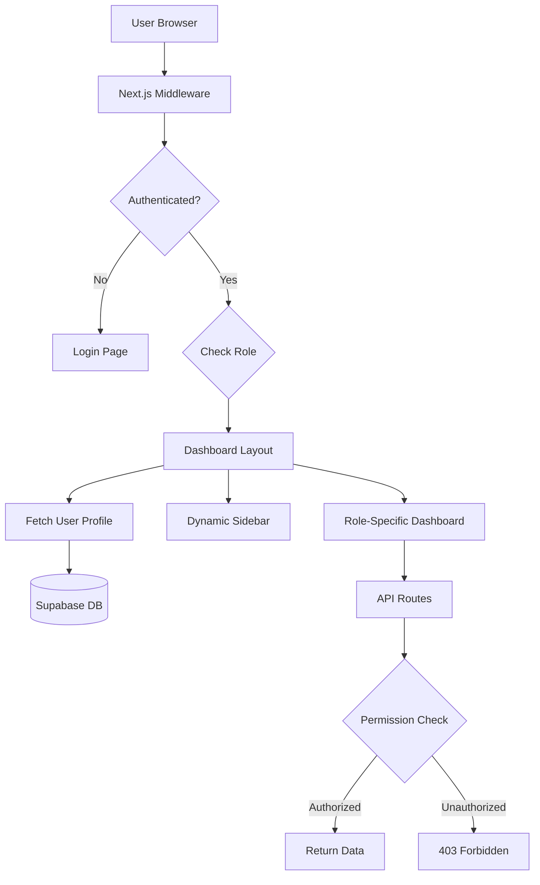

# Design Document

## Overview

This design implements a comprehensive role-based access control (RBAC) system for the RailTrack QR application. The system will provide three distinct user experiences based on roles: Inspector, Depot Manager, and Admin. Each role will have a customized dashboard, filtered navigation, and appropriate data access controls enforced at both the UI and API layers.

The design follows a defense-in-depth approach with multiple layers of security:
1. Middleware-level route protection
2. Server-side component authorization
3. API endpoint permission validation
4. Client-side UI filtering for user experience

## Architecture

### High-Level Architecture



### Role Permission Matrix

| Feature | Inspector | Depot Manager | Admin |
|---------|-----------|---------------|-------|
| Dashboard | ✓ (Inspector View) | ✓ (Depot View) | ✓ (Admin View) |
| Scan QR | ✓ | ✓ | ✓ |
| My Inspections | ✓ | ✗ | ✗ |
| Inspections (All) | ✗ | ✓ (Depot Only) | ✓ (System-wide) |
| Fittings | ✗ | ✓ (Depot Only) | ✓ (System-wide) |
| Alerts | ✗ | ✓ (Depot Only) | ✓ (System-wide) |
| Vendors | ✗ | ✗ | ✓ |
| Users | ✗ | ✗ | ✓ |
| Settings | ✗ | ✗ | ✓ |


## Components and Interfaces

### 1. Permission System

#### lib/permissions/roles.ts
Central configuration for role-based permissions:

```typescript
export type UserRole = 'inspector' | 'depot_manager' | 'admin';

export interface RoutePermission {
  path: string;
  allowedRoles: UserRole[];
  requiresDepotLocation?: boolean;
}

export const ROUTE_PERMISSIONS: RoutePermission[] = [
  { path: '/dashboard', allowedRoles: ['inspector', 'depot_manager', 'admin'] },
  { path: '/scan', allowedRoles: ['inspector', 'depot_manager', 'admin'] },
  { path: '/inspections', allowedRoles: ['inspector', 'depot_manager', 'admin'] },
  { path: '/fittings', allowedRoles: ['depot_manager', 'admin'] },
  { path: '/alerts', allowedRoles: ['depot_manager', 'admin'] },
  { path: '/vendors', allowedRoles: ['admin'] },
  { path: '/users', allowedRoles: ['admin'] },
  { path: '/settings', allowedRoles: ['admin'] },
];

export function canAccessRoute(userRole: UserRole, path: string): boolean {
  const permission = ROUTE_PERMISSIONS.find(p => path.startsWith(p.path));
  return permission ? permission.allowedRoles.includes(userRole) : false;
}

export function getNavigationItems(userRole: UserRole) {
  // Returns filtered navigation based on role
}
```

#### lib/permissions/api.ts
API-level permission validation:

```typescript
export async function validateApiPermission(
  request: NextRequest,
  requiredRoles: UserRole[]
): Promise<{ authorized: boolean; user?: User; error?: string }> {
  // Extract user from session
  // Fetch role from database
  // Validate against required roles
  // Return authorization result
}
```

### 2. Enhanced Middleware

#### middleware.ts
Updated to include role-based route protection:

```typescript
export async function middleware(request: NextRequest) {
  // Existing authentication check
  const { data: { user } } = await supabase.auth.getUser();
  
  if (!user && isProtectedRoute) {
    return NextResponse.redirect(new URL('/login', request.url));
  }

  // NEW: Role-based authorization
  if (user && isProtectedRoute) {
    const { data: profile } = await supabase
      .from('users')
      .select('role')
      .eq('id', user.id)
      .single();

    if (profile && !canAccessRoute(profile.role, request.nextUrl.pathname)) {
      return NextResponse.redirect(new URL('/unauthorized', request.url));
    }
  }

  return response;
}
```


### 3. Dynamic Dashboard Components

#### app/(dashboard)/dashboard/page.tsx
Refactored to render role-specific dashboards:

```typescript
'use client';

import { useEffect, useState } from 'react';
import { InspectorDashboard } from '@/components/dashboard/InspectorDashboard';
import { DepotManagerDashboard } from '@/components/dashboard/DepotManagerDashboard';
import { AdminDashboard } from '@/components/dashboard/AdminDashboard';

export default function DashboardPage() {
  const [userRole, setUserRole] = useState<string | null>(null);
  const [isLoading, setIsLoading] = useState(true);

  useEffect(() => {
    fetchUserRole();
  }, []);

  const fetchUserRole = async () => {
    const response = await fetch('/api/user/profile');
    const data = await response.json();
    setUserRole(data.role);
    setIsLoading(false);
  };

  if (isLoading) return <LoadingSpinner />;

  switch (userRole) {
    case 'inspector':
      return <InspectorDashboard />;
    case 'depot_manager':
      return <DepotManagerDashboard />;
    case 'admin':
      return <AdminDashboard />;
    default:
      return <UnauthorizedPage />;
  }
}
```

#### components/dashboard/InspectorDashboard.tsx
Inspector-specific dashboard showing:
- Total inspections performed
- Pass/fail rate
- Recent inspections list
- Quick action: Scan QR

#### components/dashboard/DepotManagerDashboard.tsx
Depot manager dashboard showing:
- Total fittings in depot
- Fittings by status
- Recent inspections for depot
- Active alerts for depot
- Warranty expiring soon
- Quick actions: Add Fitting, Scan QR, View Alerts

#### components/dashboard/AdminDashboard.tsx
Admin dashboard showing:
- System-wide fittings count
- System-wide inspections
- Vendor performance metrics
- User activity statistics
- Critical alerts
- Depot comparison
- Quick actions: All features


### 4. Enhanced Navigation

#### components/dashboard/Sidebar.tsx
Updated to dynamically filter navigation items:

```typescript
const NAVIGATION_CONFIG = [
  {
    name: 'Dashboard',
    href: '/dashboard',
    icon: LayoutDashboard,
    roles: ['inspector', 'depot_manager', 'admin'],
  },
  {
    name: 'Scan QR',
    href: '/scan',
    icon: ScanLine,
    roles: ['inspector', 'depot_manager', 'admin'],
  },
  {
    name: 'My Inspections',
    href: '/inspections',
    icon: ClipboardList,
    roles: ['inspector'],
  },
  {
    name: 'Fittings',
    href: '/fittings',
    icon: Package,
    roles: ['depot_manager', 'admin'],
  },
  {
    name: 'Inspections',
    href: '/inspections',
    icon: ClipboardList,
    roles: ['depot_manager', 'admin'],
  },
  {
    name: 'Alerts',
    href: '/alerts',
    icon: AlertTriangle,
    roles: ['depot_manager', 'admin'],
  },
  {
    name: 'Vendors',
    href: '/vendors',
    icon: Users,
    roles: ['admin'],
  },
  {
    name: 'Users',
    href: '/users',
    icon: UserCog,
    roles: ['admin'],
  },
  {
    name: 'Settings',
    href: '/settings',
    icon: Settings,
    roles: ['admin'],
  },
];
```

### 5. API Route Protection

#### app/api/user/profile/route.ts
New endpoint to fetch user profile with role:

```typescript
export async function GET(request: NextRequest) {
  const supabase = await createClient();
  const { data: { user } } = await supabase.auth.getUser();
  
  if (!user) {
    return NextResponse.json({ error: 'Unauthorized' }, { status: 401 });
  }

  const { data: profile } = await supabase
    .from('users')
    .select('id, name, email, role, depot_location')
    .eq('id', user.id)
    .single();

  return NextResponse.json(profile);
}
```

#### app/api/dashboard/metrics/route.ts
Enhanced to apply role-based filtering:

```typescript
export async function GET(request: NextRequest) {
  const supabase = await createClient();
  const { data: { user } } = await supabase.auth.getUser();
  
  if (!user) {
    return NextResponse.json({ error: 'Unauthorized' }, { status: 401 });
  }

  const { data: profile } = await supabase
    .from('users')
    .select('role, depot_location')
    .eq('id', user.id)
    .single();

  let fittingsQuery = supabase.from('fittings').select('*');
  let inspectionsQuery = supabase.from('inspections').select('*');
  let alertsQuery = supabase.from('alerts').select('*');

  // Apply role-based filtering
  if (profile.role === 'depot_manager' && profile.depot_location) {
    fittingsQuery = fittingsQuery.eq('current_location', profile.depot_location);
    // Join inspections with fittings to filter by depot
    inspectionsQuery = inspectionsQuery
      .select('*, fittings!inner(current_location)')
      .eq('fittings.current_location', profile.depot_location);
    alertsQuery = alertsQuery
      .select('*, fittings!inner(current_location)')
      .eq('fittings.current_location', profile.depot_location);
  } else if (profile.role === 'inspector') {
    inspectionsQuery = inspectionsQuery.eq('inspector_id', user.id);
  }

  // Fetch and return metrics
}
```


#### Protected API Endpoints

All API endpoints will be updated with permission checks:

**Fittings API** (`app/api/fittings/route.ts`):
- GET: depot_manager (depot-filtered), admin (all)
- POST: depot_manager, admin
- PUT/DELETE: depot_manager (own depot), admin (all)

**Inspections API** (`app/api/inspections/route.ts`):
- GET: inspector (own only), depot_manager (depot-filtered), admin (all)
- POST: inspector, depot_manager, admin

**Vendors API** (`app/api/vendors/route.ts`):
- GET/POST/PUT/DELETE: admin only

**Alerts API** (`app/api/alerts/route.ts`):
- GET: depot_manager (depot-filtered), admin (all)
- PUT (resolve): depot_manager, admin

**Users API** (`app/api/users/route.ts`) - NEW:
- GET/POST/PUT/DELETE: admin only

### 6. User Management Interface

#### app/(dashboard)/users/page.tsx
New admin-only page for user management:

```typescript
'use client';

export default function UsersPage() {
  return (
    <div>
      <PageHeader title="User Management" />
      <UserTable />
      <AddUserDialog />
    </div>
  );
}
```

#### components/users/UserTable.tsx
Displays all users with actions:
- Edit user details
- Change user role
- Update depot location
- Deactivate/activate user

#### components/users/AddUserDialog.tsx
Form to create new users:
- Email (required)
- Name (required)
- Role (dropdown: inspector, depot_manager, admin)
- Depot Location (required for depot_manager)
- Phone (optional)

### 7. Settings Interface

#### app/(dashboard)/settings/page.tsx
New admin-only settings page:

```typescript
'use client';

export default function SettingsPage() {
  return (
    <div>
      <PageHeader title="System Settings" />
      <Tabs defaultValue="general">
        <TabsList>
          <TabsTrigger value="general">General</TabsTrigger>
          <TabsTrigger value="integrations">Integrations</TabsTrigger>
          <TabsTrigger value="notifications">Notifications</TabsTrigger>
          <TabsTrigger value="defaults">Defaults</TabsTrigger>
        </TabsList>
        <TabsContent value="general"><GeneralSettings /></TabsContent>
        <TabsContent value="integrations"><IntegrationSettings /></TabsContent>
        <TabsContent value="notifications"><NotificationSettings /></TabsContent>
        <TabsContent value="defaults"><DefaultSettings /></TabsContent>
      </Tabs>
    </div>
  );
}
```


### 8. Unauthorized Access Page

#### app/unauthorized/page.tsx
Displays when users attempt to access restricted routes:

```typescript
export default function UnauthorizedPage() {
  return (
    <div className="flex flex-col items-center justify-center min-h-screen">
      <ShieldX className="h-24 w-24 text-red-500 mb-4" />
      <h1 className="text-3xl font-bold mb-2">Access Denied</h1>
      <p className="text-muted-foreground mb-6">
        You don't have permission to access this page
      </p>
      <div className="flex gap-4">
        <Button asChild>
          <Link href="/dashboard">Go to Dashboard</Link>
        </Button>
        <Button variant="outline" asChild>
          <Link href="mailto:admin@railtrack.com">Contact Admin</Link>
        </Button>
      </div>
    </div>
  );
}
```

## Data Models

### User Profile Extension
The existing `users` table already contains the necessary fields:
- `id`: User identifier
- `email`: User email
- `name`: User name
- `role`: 'inspector' | 'depot_manager' | 'admin'
- `depot_location`: Depot location (required for depot_manager)
- `phone`: Contact number

### Settings Table (NEW)
Create a new table for system settings:

```sql
CREATE TABLE settings (
  id UUID PRIMARY KEY DEFAULT uuid_generate_v4(),
  key VARCHAR(255) UNIQUE NOT NULL,
  value JSONB NOT NULL,
  category VARCHAR(50) NOT NULL,
  updated_by UUID REFERENCES users(id),
  updated_at TIMESTAMP DEFAULT NOW()
);
```

Example settings:
```json
{
  "key": "system.name",
  "value": "RailTrack QR System",
  "category": "general"
}
```

### Audit Log Table (NEW)
Track unauthorized access attempts and role changes:

```sql
CREATE TABLE audit_logs (
  id UUID PRIMARY KEY DEFAULT uuid_generate_v4(),
  user_id UUID REFERENCES users(id),
  action VARCHAR(100) NOT NULL,
  resource VARCHAR(255),
  details JSONB,
  ip_address VARCHAR(45),
  user_agent TEXT,
  timestamp TIMESTAMP DEFAULT NOW()
);
```


## Error Handling

### Permission Denied Scenarios

1. **Route Access Denied**
   - Middleware redirects to `/unauthorized`
   - User sees clear message with their current role
   - Option to return to dashboard or contact admin

2. **API Permission Denied**
   - Return 403 Forbidden status
   - Include error message: "Insufficient permissions"
   - Log attempt in audit_logs table

3. **Data Not Found Due to Filtering**
   - Return empty array/null
   - Display "No data available" message in UI
   - Don't reveal existence of filtered data

4. **Role Fetch Failure**
   - Fallback to most restrictive role (inspector)
   - Log error for investigation
   - Display warning banner to user

### Error Response Format

```typescript
interface ApiError {
  error: string;
  code: 'UNAUTHORIZED' | 'FORBIDDEN' | 'NOT_FOUND' | 'SERVER_ERROR';
  message: string;
  details?: any;
}
```

## Testing Strategy

### Unit Tests

1. **Permission Functions**
   - Test `canAccessRoute()` for all role combinations
   - Test `getNavigationItems()` returns correct items per role
   - Test `validateApiPermission()` with various scenarios

2. **Data Filtering**
   - Test depot_manager sees only their depot data
   - Test inspector sees only their inspections
   - Test admin sees all data

3. **Navigation Filtering**
   - Test each role sees correct menu items
   - Test navigation items link to correct routes

### Integration Tests

1. **Middleware Protection**
   - Test authenticated users can access allowed routes
   - Test users are redirected when accessing forbidden routes
   - Test unauthenticated users are redirected to login

2. **API Endpoint Protection**
   - Test each endpoint with different roles
   - Test 403 responses for unauthorized access
   - Test data filtering in responses

3. **Dashboard Rendering**
   - Test correct dashboard renders for each role
   - Test dashboard widgets show filtered data
   - Test quick actions are role-appropriate

### End-to-End Tests

1. **Inspector Workflow**
   - Login as inspector
   - Verify dashboard shows only inspection stats
   - Verify can scan QR and create inspection
   - Verify cannot access fittings, vendors, settings

2. **Depot Manager Workflow**
   - Login as depot manager
   - Verify dashboard shows depot-specific data
   - Verify can manage fittings for their depot
   - Verify cannot access vendors, users, settings

3. **Admin Workflow**
   - Login as admin
   - Verify dashboard shows system-wide data
   - Verify can access all features
   - Verify can manage users and settings


## Security Considerations

### Defense in Depth

1. **Middleware Layer**
   - First line of defense
   - Validates authentication and role
   - Redirects unauthorized access attempts
   - Prevents route access before page load

2. **Server Component Layer**
   - Validates user role in layout components
   - Fetches user profile securely
   - Passes role to client components safely

3. **API Layer**
   - Validates every API request
   - Checks user authentication
   - Verifies role permissions
   - Applies data filtering

4. **Client Layer**
   - Hides UI elements based on role
   - Provides better UX
   - NOT relied upon for security

### Session Management

- User role stored in database, not in JWT
- Role fetched on each request to prevent stale data
- Session invalidated when role changes
- Audit log tracks role changes

### Data Filtering

- Applied at database query level
- Never rely on client-side filtering
- Use Supabase RLS policies as additional layer
- Validate depot_location exists before filtering

### Audit Logging

Log the following events:
- Unauthorized access attempts
- Role changes
- User creation/deactivation
- Settings modifications
- Failed permission checks

### Rate Limiting

Implement rate limiting on sensitive endpoints:
- User management endpoints: 10 requests/minute
- Settings endpoints: 20 requests/minute
- Authentication endpoints: 5 requests/minute

## Performance Considerations

### Caching Strategy

1. **User Role Caching**
   - Cache user role in server component for request duration
   - Invalidate on role change
   - Don't cache across requests

2. **Navigation Items**
   - Compute once per page load
   - Memoize in client component
   - Recompute on role change

3. **Dashboard Metrics**
   - Cache for 5 minutes
   - Provide manual refresh option
   - Use stale-while-revalidate pattern

### Database Optimization

1. **Indexes**
   - Add index on `users.role`
   - Add index on `fittings.current_location`
   - Add index on `inspections.inspector_id`

2. **Query Optimization**
   - Use select() to fetch only needed fields
   - Avoid N+1 queries with proper joins
   - Use count() for metrics instead of fetching all records

### Bundle Size

- Code-split dashboard components by role
- Lazy load admin-only features
- Tree-shake unused permissions code


## Migration Strategy

### Phase 1: Foundation (No Breaking Changes)
1. Create permission utilities (`lib/permissions/`)
2. Create new API endpoints (`/api/user/profile`, `/api/users`)
3. Add unauthorized page
4. Create role-specific dashboard components
5. Update middleware with role checks (log only, don't block)

### Phase 2: Dashboard Updates
1. Update main dashboard page to render role-specific components
2. Update dashboard metrics API with role-based filtering
3. Test with existing users

### Phase 3: Navigation & Route Protection
1. Update Sidebar component with role-based filtering
2. Enable middleware blocking for unauthorized routes
3. Update all API endpoints with permission checks

### Phase 4: Admin Features
1. Create users management page
2. Create settings page
3. Add audit logging

### Phase 5: Testing & Refinement
1. Comprehensive testing with all roles
2. Performance optimization
3. Security audit
4. Documentation updates

### Rollback Plan

If issues arise:
1. Disable middleware blocking (revert to logging only)
2. Revert dashboard to original unified version
3. Keep permission utilities for future use
4. Investigate and fix issues
5. Re-deploy with fixes

## Deployment Checklist

- [ ] Database migrations applied (settings, audit_logs tables)
- [ ] Environment variables configured
- [ ] All existing users have valid roles assigned
- [ ] Depot managers have depot_location assigned
- [ ] Permission utilities tested
- [ ] Middleware tested with all roles
- [ ] API endpoints tested with all roles
- [ ] Dashboard components tested with all roles
- [ ] Navigation tested with all roles
- [ ] Unauthorized page tested
- [ ] User management tested (admin only)
- [ ] Settings page tested (admin only)
- [ ] Audit logging verified
- [ ] Performance benchmarks met
- [ ] Security review completed
- [ ] Documentation updated
- [ ] Training materials prepared for users

## Future Enhancements

1. **Fine-Grained Permissions**
   - Move from role-based to permission-based system
   - Allow custom permission sets per user
   - Support permission inheritance

2. **Multi-Depot Support**
   - Allow depot managers to manage multiple depots
   - Add depot switching UI
   - Support depot hierarchies

3. **Temporary Access**
   - Time-limited role elevation
   - Temporary admin access for support
   - Automatic role reversion

4. **Advanced Audit Logging**
   - Real-time audit log viewer
   - Anomaly detection
   - Compliance reporting

5. **Role Templates**
   - Predefined role configurations
   - Custom role creation
   - Role cloning
